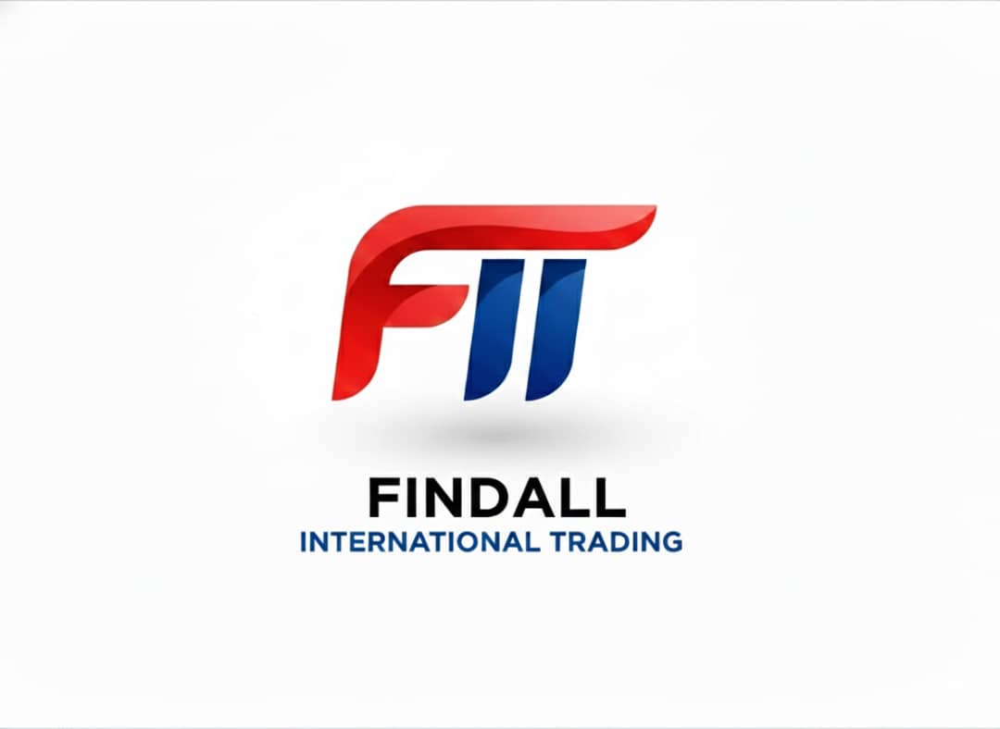

<div align="center">



# FINDALL International Trading — Website

**Production-grade multilingual website built for a real client**

[](https://nextjs.org/)
[](https://www.typescriptlang.org/)
[](https://tailwindcss.com/)
[](https://www.framer.com/motion/)
[](https://ui.shadcn.com/)

</div>

---

## 🌍 Overview

Corporate website for **FINDALL International Trading Groupe SARL**, a Cameroonian trading company operating across Africa, Asia and Europe. Built from scratch as a freelance project with full attention to UX, performance and design quality.

> **Live client project** — designed, architected and developed solo.

---

## ✨ Features

- 🌐 **Multilingual** — Full FR/EN support via `next-intl` with automatic locale routing
- 🌗 **Dark / Light mode** — System-aware with manual toggle, zero flash on load
- 🎬 **Scroll-driven parallax** — Layered depth effects using `framer-motion` `useScroll` + `useTransform`
- 🃏 **Animated sections** — Staggered reveals, timeline, 3D card hover, floating badges
- 📱 **Fully responsive** — Mobile-first, desktop-optimized layouts
- ♿ **Accessible** — Semantic HTML, keyboard navigation, ARIA labels
- ⚡ **Performance** — App Router, server components, optimized images

---

## 🛠️ Tech Stack

| Category | Technology |
|----------|-----------|
| Framework | Next.js 16 (App Router) |
| Language | TypeScript |
| Styling | Tailwind CSS v3 |
| UI Components | shadcn/ui (Radix primitives) |
| Animations | Framer Motion 11 |
| i18n | next-intl |
| Theme | next-themes |
| Icons | react-icons, react-country-flag |

## 🎨 Design Decisions

### Parallax Strategy
Three independent parallax layers per section using `useScroll` + `useTransform`:
- **Background layer** — moves at 40% scroll speed (slowest)
- **Content layer** — moves at 25% scroll speed
- **Decorative orbs** — move at 60% scroll speed (fastest depth)

### Dark / Light Mode
Rather than relying solely on Tailwind's `dark:` prefix, each component reads `useTheme()` and applies conditional classes. This allows fine-grained control over gradients, shadows, glow opacities and blur intensities that can't be expressed with a simple color swap.

### Component Architecture
Every section is a self-contained component with its own:
- Parallax scroll hook
- `FadeIn` scroll-triggered animation wrapper
- Dark/light mode logic
- Translation calls

This makes sections **reusable across pages** — the `/services` page simply imports `<ServicesSection />` with an added `<PageHeader />`.

---

## 🚀 Getting Started

```bash
# Clone
git clone https://github.com/your-username/findall-sourcing-international.git
cd findall-sourcing-international

# Install
npm install

# Dev
npm run dev
```

Open [http://localhost:3000](http://localhost:3000)

---

## 📸 Pages

| Route | Description |
|-------|-------------|
| `/fr` or `/en` | Home — Hero, About, Services, Sourcing, Contact |
| `/fr/about` | Company overview |
| `/fr/services` | 8 service areas |
| `/fr/sourcing` | China sourcing process timeline |
| `/fr/contact` | Contact cards + WhatsApp CTA |

---

## 👤 About the Developer

Built by **[phanuel alibia]** — Full-Stack Developer specializing in modern React ecosystems.

- 💼 [LinkedIn](https://www.linkedin.com/in/phanuel-tsopze-8a33a52a4/)
- 🐙 [GitHub](https://github.com/alibia-phanuel)
- 📧 [ton@email.com](mailto:phanuel.alibia@gmail.com)

---

<div align="center">

**FINDALL International Trading Groupe SARL** — Yaoundé, Cameroun 🇨🇲

*Connecting the world to emerging markets.*

</div>


